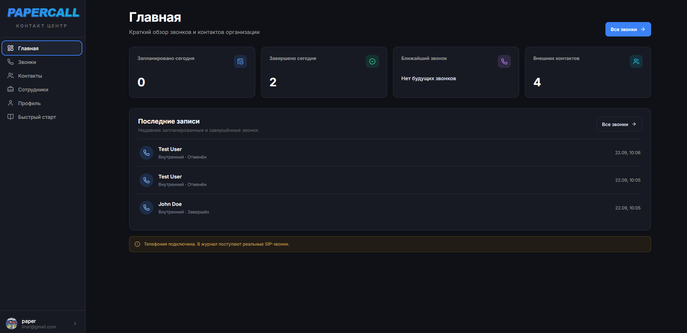
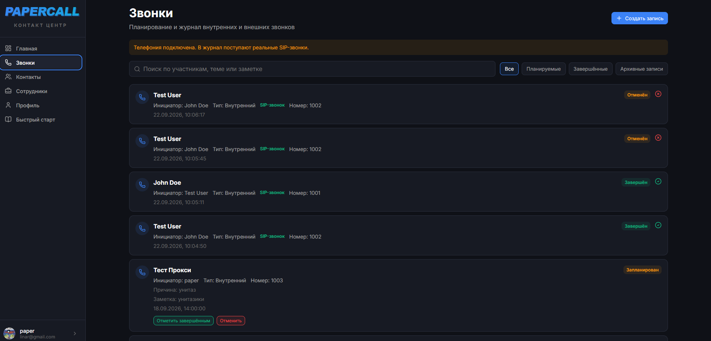
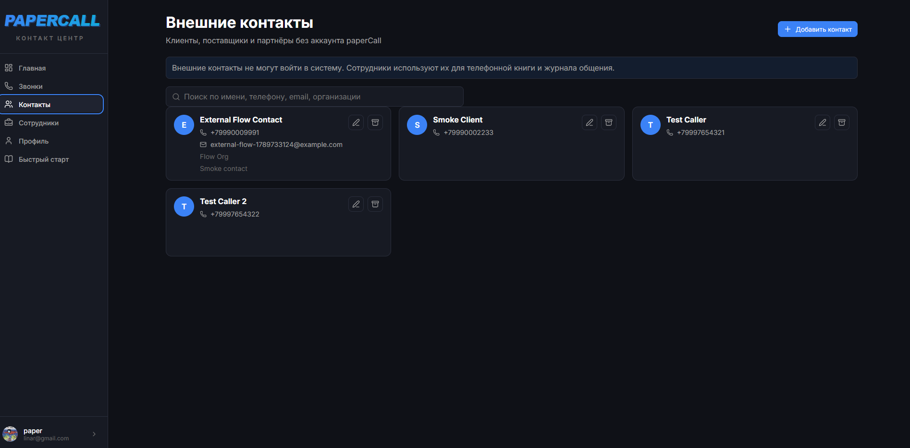
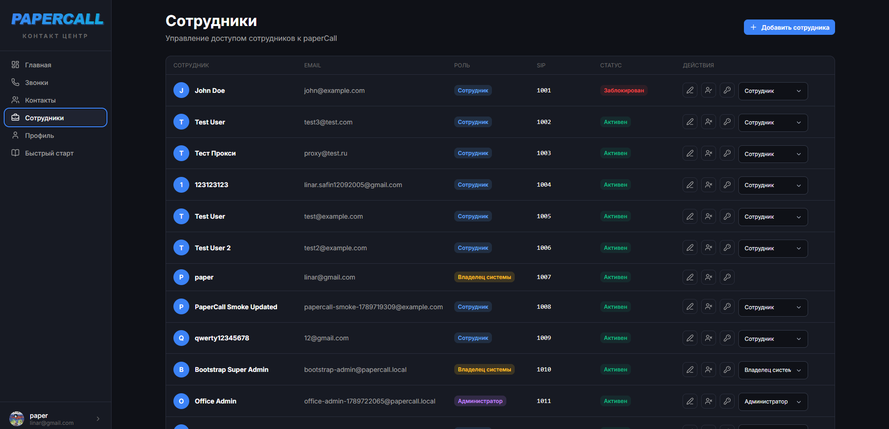
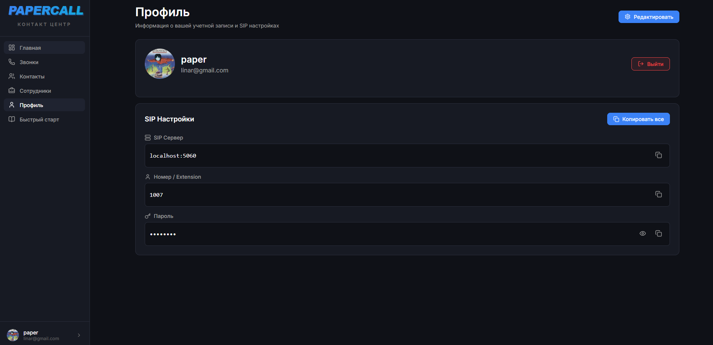
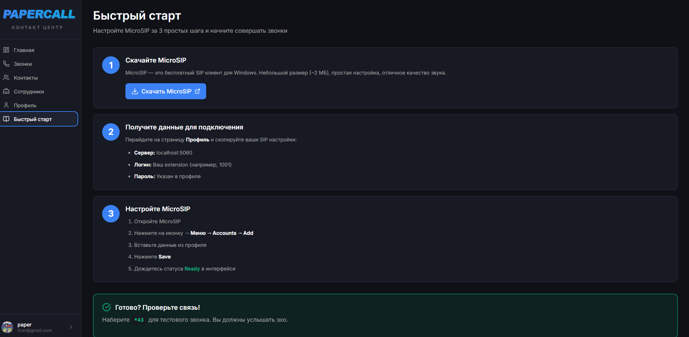

# paperCall

paperCall — офисная система для сотрудников, внутренних SIP-звонков, внешних контактов и журнала звонков. Приложение объединяет веб-интерфейс, Spring Boot API, MySQL и локальную SIP-телефонию через Asterisk.

## Возможности

- сотрудники и переходные роли доступа;
- основа организаций (tenant foundation) с изоляцией данных;
- внешние контакты без учётной записи paperCall;
- планирование внутренних и внешних звонков;
- реальные внутренние SIP-звонки через Asterisk;
- журнал звонков и статусы планируемых и завершённых вызовов;
- фильтрация клиентов, звонков и операторов по текущей организации;
- AMI доступен только внутри Docker-сети и не публикуется наружу.

## Скриншоты интерфейса

Актуальные экраны интерфейса без открытых паролей и токенов:

### Главная



Краткий обзор запланированных и завершённых звонков, ближайших событий и внешних контактов.

### Звонки



Планируемые записи и события реальных SIP-звонков с фильтрами по статусам.

### Внешние контакты



Телефонная книга клиентов, поставщиков и партнёров, которые не входят в систему.

### Сотрудники



Управление сотрудниками, ролями, статусами и SIP extension.

### Профиль



Профиль пользователя и SIP-настройки. Пароль на скриншоте скрыт.

### Быстрый старт



Пошаговая настройка SIP-клиента и проверка внутренней связи.

## Архитектура

```text
Браузер
   │
   ▼
Nginx ── React/Vite frontend
   │
   ▼
Spring Boot backend
   ├── MySQL       данные пользователей, организаций, контактов и звонков
   ├── Redis       быстрые статусы операторов
   ├── Kafka       события звонков
   └── Asterisk    PJSIP-телефония и AMI-события
```

Основные компоненты запускаются через Docker Compose:

- **Frontend:** React/Vite;
- **Backend:** Spring Boot;
- **MySQL:** основная база данных;
- **Redis:** кэш статусов;
- **Kafka:** обмен событиями;
- **Asterisk:** SIP/PJSIP и AMI;
- **Nginx:** единая точка входа и reverse proxy;
- **Docker Compose:** локальная оркестрация сервисов.

## Роли

В текущей версии используются переходные роли:

| Роль в интерфейсе | Техническая роль | Возможности |
|---|---|---|
| Владелец системы | `SUPER_ADMIN` | Полное администрирование текущей установки. |
| Администратор | `ADMIN` | Управление сотрудниками, контактами и рабочими сущностями организации. |
| Сотрудник | `USER` | Профиль, доступные контакты и собственные рабочие звонки. |
| Оператор | `OPERATOR` | Рабочий профиль и операции, связанные с операторским статусом. |

Полное переименование ролей и отдельный SaaS-переключатель организаций пока не реализованы.

## Быстрый локальный запуск

### Требования

- Docker Desktop с включённой WSL Integration при работе из WSL;
- Docker Compose v2;
- свободные ресурсы для MySQL, Redis, Kafka, API, frontend, Nginx и Asterisk;
- SIP-клиент, если требуется проверить телефонию.

### Настройка локальных секретов

Создайте игнорируемый Git файл:

```bash
cp .env.example .env
```

В `.env` задайте собственные случайные значения для:

- `MYSQL_PASSWORD`;
- `MYSQL_ROOT_PASSWORD`;
- `JWT_SECRET`;
- `ASTERISK_AMI_PASSWORD`;
- `SIP_PASSWORD_1001` и `SIP_PASSWORD_1002`, если запускается telephony-профиль.

Не добавляйте `.env` в Git и не публикуйте эти значения в отчётах, issue или README.

### Запуск базового стека

```bash
docker compose up -d mysql redis kafka api frontend nginx
```

Для проверки SIP-телефонии:

```bash
docker compose --profile telephony up -d asterisk
```

Проверить состояние:

```bash
docker compose ps
```

Откройте приложение:

```text
http://localhost
```

Войдите под существующей учётной записью или под администраторской учётной записью, настроенной через локальные переменные запуска. Пароли в README не хранятся.

## SIP-телефония

Asterisk запускается отдельным профилем `telephony`.

- SIP использует UDP `5060`;
- RTP использует локальный диапазон, заданный Compose;
- SIP/RTP рассчитаны на доверенную LAN-сеть;
- AMI не публикуется на host и доступен только API внутри Docker-сети;
- SIP-пароли подставляются в Asterisk только во время запуска из локального `.env`;
- extension и SIP-пароли не нужно хранить в Git.

Если SIP-клиент работает на том же компьютере, используйте сервер:

```text
localhost:5060
```

Если SIP-клиент работает на телефоне или другом компьютере в LAN, используйте LAN IP хоста, на котором запущен Asterisk, и UDP-порт `5060`.

Для проверки настройте два SIP-устройства на разные внутренние номера и позвоните с одного устройства на другое. Конкретные пароли в документации не приводятся.

Не публикуйте SIP/RTP в Интернет без VPN, TLS и дополнительной настройки firewall.

## Как добавить сотрудника

1. Войдите пользователем с правами администратора.
2. Откройте раздел **Сотрудники**.
3. Нажмите **Добавить сотрудника**.
4. Заполните имя, email, телефон и роль.
5. Сохраните сотрудника.
6. Передайте сотруднику временный пароль безопасным способом.
7. При первом входе сотрудник меняет временный пароль.
8. SIP-настройки сотрудник видит в профиле.

Сотруднику не нужен SSH-доступ и доступ к серверу. Создание учётной записи выполняется через web UI.

## Внешние контакты и звонки

Сотрудники имеют учётные записи и могут работать в системе. Внешние контакты не входят в систему и используются как телефонная книга.

В paperCall поддерживаются:

- планируемые внутренние звонки;
- планируемые звонки внешним контактам;
- реальные внутренние SIP-звонки;
- журнал событий и статусов звонков.

События, полученные от Asterisk через AMI, попадают в журнал звонков backend.

## Multi-tenant foundation

В системе добавлена основа tenant-модели:

- организация владеет сотрудниками, контактами и звонками;
- membership связывает пользователя с организацией и ролью;
- backend фильтрует clients, calls и operators по текущей организации;
- сейчас используется одна организация без переключателя в интерфейсе;
- структура базы и API подготовлена к дальнейшему добавлению нескольких компаний.

Это ещё не завершённый SaaS-продукт: полноценный UI переключения организаций и биллинг отсутствуют.

## Безопасность

- `.env` исключён из Git;
- AMI и SIP secrets не хранятся в исходниках;
- AMI не публикуется наружу;
- не публикуйте SIP/RTP в Интернет без VPN/TLS и firewall;
- backup храните вне репозитория;
- не вставляйте пароли, JWT и credentials в README, issue или логи;
- production deployment требует отдельного управления secrets и TLS.

## Проверки

Backend:

```bash
cd app
./mvnw test
```

Frontend:

```bash
cd frontend
npm run lint
npm run build
```

Compose:

```bash
docker compose config
docker compose ps
```

## Ограничения и будущие задачи

- автоматическое provisioning SIP endpoint для новых сотрудников;
- полноценный multi-tenant UI и переключение организаций;
- WebRTC не реализован;
- production deployment, домен и TLS;
- VPN и production firewall policy;
- интеграция с billing и SaaS-лимитами;
- переход от статической конфигурации Asterisk к масштабируемому provisioning/realtime-подходу.
